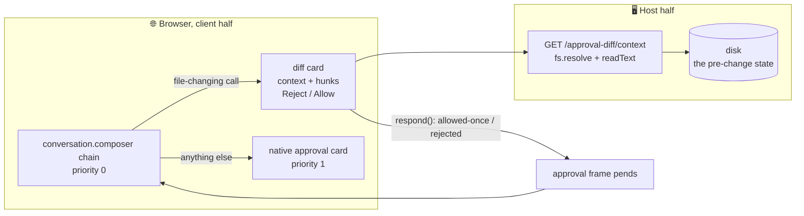

# dsh-approval-diff

A [DeepSeek Harness](https://github.com/deepseek-ai/deepseek-harness) (DSH)
plugin: install it into a profile alongside your own plugins.

**See what you approve.** When the model asks permission to change a file, the
native card shows the tool arguments: `old_string` and `new_string` as raw
text, no file context, no line numbers. This plugin replaces that ask with a
real diff review: red and green lines side by side, word-level highlights
inside changed lines, surrounding file content with true line numbers, and
exactly two buttons.

## Plugin value proposition

| alternative | falls short |
|---|---|
| the native approval card | raw tool arguments; you reconstruct the diff in your head, every ask |
| reading the file yourself | you become the diff engine, and the model already read it once |
| auto-approve and hope | no review at all |

## What you get

- True line diffs for `edit`: LCS line matching plus word-level highlights;
  unchanged lines inside an edit's operands render as context, not as changes
- Split or Unified view (GitHub style toggle, choice remembered); unified
  groups each change run as all removed lines, then all added
- New files (`write`) render one-sided, all green; deletions (`rm` and
  friends) render the full current file in red before you decide
- One file per card: consecutive calls on the same file merge into one diff
  and one decision; every other call gets its own card at its own turn
- Two buttons, Reject and Allow, scoped to exactly what the card shows
- Minimize collapses the card without deciding; the close button hands that
  request back to the native card
- Requests that cannot succeed never reach you (see below)

## How it works

The card takes over the conversation composer ahead of the native approval
card (priority 0 vs 1) whenever the pending approval is a file change it can
render. Everything else falls through untouched.

Context comes from disk, not from the conversation. A small host route
(`/approval-diff/context`) reads the file at approval time: while an edit
pends, disk is exactly the pre-change state, so the diff context is real. No
transcript archaeology, no asking the model to read anything. The route is
loopback like `/api` and `/plugins`, serves text capped at 1 MiB, and is the
only host surface; everything else lives in the browser bundle.



## One file per card

Exclusive tools run one at a time, so approvals arrive sequentially. The card
reviews the pending call plus its contiguous same-file run: two edits to the
same file in a row become one diff, and one Allow covers both. It
deliberately stops there:

- an approval must be self-contained: nothing you click may sit stranded
  behind an unrelated pending decision
- a queued call from a different file can turn out to never be asked at all
  (validation can kill it before its turn); rendering it would show a
  decision that does not exist
- a different kind of change on the same file (an `rm` after edits) is a
  different decision and gets its own card

## Doomed requests are not your problem

Some approvals are dead on arrival: the text to replace is no longer in the
file, it appears twice without `replace_all`, or the file changed since this
session last wrote it. The card can prove these against the disk copy it
already fetched. Proven-doomed requests are never shown; they are quietly
forwarded so the harness's own validation produces the genuine error, with
its remedy, for the model. A forwarded allow cannot mutate anything: every
condition predicted here is one the harness checks before writing.

Prediction stays deliberately narrow. Only failures provable from the card's
own data (the call arguments plus current disk) are predicted. Nothing else
is guessed, and anything unknown renders as a normal card for you to decide.

## How to install

Requires a DeepSeek Harness checkout and a profile (here `web`):

```sh
# from the harness checkout
pnpm dsh plugin --profile web add /path/to/dsh-approval-diff

# verify the profile still composes
pnpm dsh --profile web --dump-config
```

Restart the harness after installing: the host route loads at boot. The
client half hot-reloads once installed.

## Tests

```sh
node test/client.test.mjs
```

47 checks: host route contract, chain selection, diff rendering (split and
unified), context dedup, per-file scoping, run merging and queued delivery,
doom detection, dismissal and fallthrough.

## Design notes

- Two buttons only. Pending/queued counters were tried and removed: a counter
  suggests a partial decision that does not exist. Allow means "apply
  everything this card shows for this file", Reject means "none of it".
- The deletion view shows the file as it is on disk right now. A pending
  `rm` means the file still exists, so the full content is the truth you are
  deciding against.
- The composer takeover is a content swap, not a layout jump: the card sits
  in the input capsule's footprint, same width rules, scrollable diff without
  a visible scrollbar.
- Everything degrades. No disk context: the diff still renders, without
  context lines. Route absent: same. Nothing about the decision path depends
  on the presentation layer.

## Limitations

- File-changing approvals only (`edit`, `write`, deletion-only `bash`).
  Everything else is the native card's job.
- Deletion review reads targets from disk; glob targets render as the
  pattern.
- One approval at a time, matching the native card's behavior.
